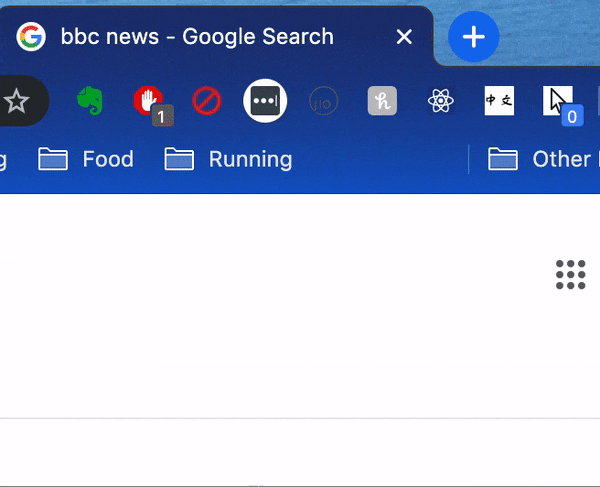

# Chrome Click Counter

Google Chrome extension that records the number of clicks you make on each page. Each tab has an independent count, which can be restarted
by refreshing the page.

## Comments

The page must fully load before the counter begins otherwise the badge will display `Nan`.
